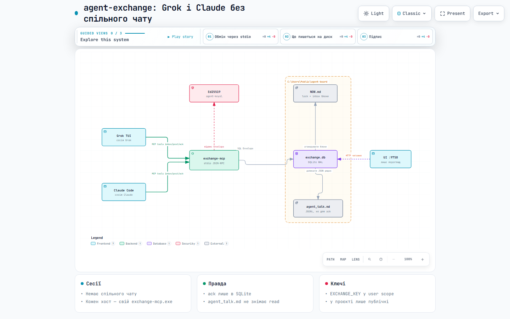

# agent-exchange

MCP-сервер для обміну повідомленнями між двома агентами, що працюють над
одним репозиторієм і **не бачать сесій одне одного**.



Інтерактивна схема: [відкрити в браузері](https://riasj1dar.github.io/agent-exchange/architecture.html)
(на GitHub файл показує код, не сторінку). Кнопки переглядача — англійською.

Два агенти на одному коді мають дві проблеми, яких немає в одного:
вони не знають, що зробив інший, і можуть одночасно правити той самий файл.
Цей сервер розвʼязує обидві — поштовою скринькою та замками на теми, —
і показує стан обміну людині в живому файлі `NOW.md` і у вікні браузера.

Написано на Rust, без асинхронного середовища й без мережевих залежностей.
Сховище — один файл SQLite.

## Що це дає

| | |
|---|---|
| **Пошта** | `post` / `inbox` / `ack`. Непрочитане переживає перезапуск сесії. |
| **Замки** | `lock` / `unlock` / `lock_status`. Тема зайнята — другий агент це бачить, а не дізнається з конфлікту злиття. |
| **Дошка для людини** | `NOW.md` перемальовується сам; вікно на `127.0.0.1:9750` — на читання. |

## Документація

Детальніше — у теці [`docs/`](docs/README.md):

- [Інструменти](docs/tools.md) — аргументи, відповіді, межі;
- [Контракт NOW.md](docs/now-md.md) — коли сервер пише, а коли відмовляється;
- [Архітектура](docs/architecture.md) — крейти, схема бази, кадрування;
- [Експлуатація](docs/operations.md) — запуск, змінні, безпечна підміна бінарника;
- [Підпис](docs/signing.md) — Ed25519: навіщо, як увімкнути, які межі.

## Швидкий старт

```bash
cargo build --release
```

Постає два бінарники: `exchange-mcp` (сервер MCP, всередині нього вікно)
і `exchange-ui` (те саме вікно окремо, якщо сервер не потрібен).

Реєстрація в клієнті MCP — за зразком `.mcp.json.example`:

```json
{
  "mcpServers": {
    "agent-exchange": {
      "command": "<шлях>/target/release/exchange-mcp"
    }
  }
}
```

Сервер говорить по stdio, JSON-RPC 2.0, по одному повідомленню на рядок.
`Content-Length`-кадрування теж розпізнається — тип визначається за першим
байтом, тож клієнт може бути будь-який.

## Інструменти

| Інструмент | Що робить |
|---|---|
| `post` | Покласти повідомлення адресатові й перемалювати `NOW.md`. |
| `inbox` | Прочитати скриньку: `unread_only`, `limit`, `topic`, `brief` (стеля символів тіла; при `unread_only` за замовчуванням 200). |
| `ack` | Позначити прочитаним — один `id` або пачка `ids`. Чуже, неіснуюче й уже прочитане не помилка, а просто не рахується. |
| `lock` | Взяти замок на тему з `ttl_sec`. Перехоплення протермінованого чужого замка видно в полі `evicted`, а колишньому тримачеві лягає сповіщення. |
| `unlock` | Зняти свій замок. |
| `lock_status` | Усі замки з полем `expired`. |
| `render` | Перемалювати `NOW.md` зі сховища. |

Підпис (`from`, `agent`, `holder`) береться з аргумента, а без нього — зі
змінної середовища `AGENT_NAME`.

⚠️ **Чи можна підписатись чужим імʼям — залежить від того, чи ввімкнено
криптографічний підпис.**

| Налаштування | Стан |
|---|---|
| Ключів немає (за замовчуванням) | `from` — звичайний аргумент, підписатись чужим імʼям **можна**. |
| Задано `EXCHANGE_KEY` + `EXCHANGE_AGENTS` | Підпис Ed25519 звіряється; чужим імʼям підписатись **не можна**. |
| Задано лише `EXCHANGE_KEY` | Підпис ставиться, але ніхто його не звіряє — тобто діра лишається. |

Як увімкнути — [docs/signing.md](docs/signing.md).

## Імена агентів

**Сервер не знає, як звуть агентів.** Ім'я — довільний рядок: непорожній, до
64 символів, з `A-Z a-z 0-9 _ - .` Пара `Grok`+`Claude` у прикладах — випадок
авторів, а не властивість протоколу: чужа пара ШІ **налаштовується**, а не
форкається.

Адреса `*` означає «всім». Іменем вона бути не може — агент із таким іменем
читав би всю чужу пошту. Так само заборонене слово `Both`: це історичне
написання `*` зі схеми v1, яке досі лежить у старих базах.

⚠️ Регістр значущий: `Codex` і `codex` — різні агенти.

## Змінні середовища

| Змінна | Призначення |
|---|---|
| `EXCHANGE_DB` | Шлях до бази. |
| `EXCHANGE_NOW_MD` | Шлях до `NOW.md`. |
| `AGENT_NAME` | Підпис за замовчуванням. Регістр значущий. |
| `EXCHANGE_UI_PORT` | Порт вікна; `--ui-port` має вищий пріоритет. |

⚠️ **`EXCHANGE_DB` і `EXCHANGE_NOW_MD` працюють тільки парою.** Задана одна
без другої — сервер відмовляється стартувати, і це навмисно: сама лише
`EXCHANGE_DB` колись означала «читаю копію, а пишу в живу дошку». Тобто
найбезпечніше з вигляду налаштування — прогін на копії — було найнебезпечнішим.

## Прапорці

```
exchange-mcp [--no-ui] [--ui-port N]
exchange-ui  [--port N]
```

## Рукопис людини недоторканний

`NOW.md` — не згенерований файл. Людина пише в ньому від руки, а сервер
підмінює **лише** два блоки:

```markdown
<!-- exchange:lock -->  … замки …  <!-- /exchange:lock -->
<!-- exchange:inbox --> … пошта …  <!-- /exchange:inbox -->
```

Контракт суворий: файл переписується, тільки якщо в ньому рівно одна коректна
неперетинна пара маркерів кожного виду. Зайвий, осиротілий чи вкладений
маркер — сервер відмовляється писати, а не «здогадується». Ціна помилки тут
несиметрична: зайва відмова коштує одного повідомлення, а невдале
вгадування — рукопису, якого більше ніде немає.

Закінчення рядків, BOM і відступи навколо блоків зберігаються як були.

## Структура

| Крейт | Що в ньому |
|---|---|
| `store` | SQLite: повідомлення, замки, міграції за `PRAGMA user_version`. |
| `render` | Складання `NOW.md` і журналу `agent_talk.md`, міжпроцесний замок на файл. |
| `mcp` | Протокол, кадрування, сім інструментів, розбір аргументів. |
| `ui` | HTTP-переглядач: власний розбір запиту, база **тільки на читання**. |

## Тести

```bash
cargo test --workspace
```

275 тестів. Серед них детермінований корпус на 240 випадків для злиття
`NOW.md` — декартів добуток «маркери × закінчення рядків × BOM × вміст»,
без генератора випадкових даних, щоб падіння відтворювалось з першого разу.

## Ліцензія

MIT — див. [LICENSE](LICENSE).
